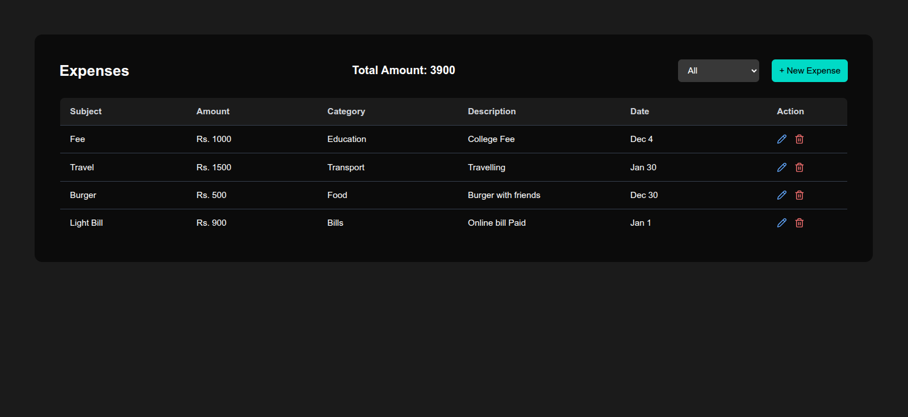
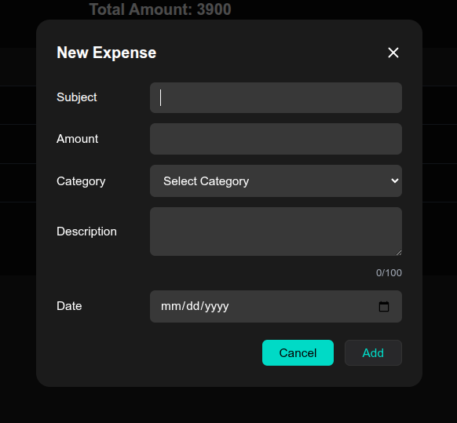

# Expense Tracker App

A responsive expense tracker built with React and Tailwind CSS.
Users can add, edit, delete, and filter expenses. All data is saved
in the browser using localStorage.

## Features

- Add new expenses
- Edit and delete expenses
- Filter expenses by category
- Total amount updates based on selected category
- Data persistence using localStorage
- Fully responsive design (mobile & desktop)

## Tech Stack

- React
- Tailwind CSS
- JavaScript
- Lucide React Icons

## Installation

1. Clone the repository
   git clone https://github.com/Tayyab365/expense-tracker-app.git

2. Install dependencies
   npm install

3. Run the project
   npm run dev

## Live Demo

https://tayyab-expense-tracker.vercel.app/

## Screenshots

